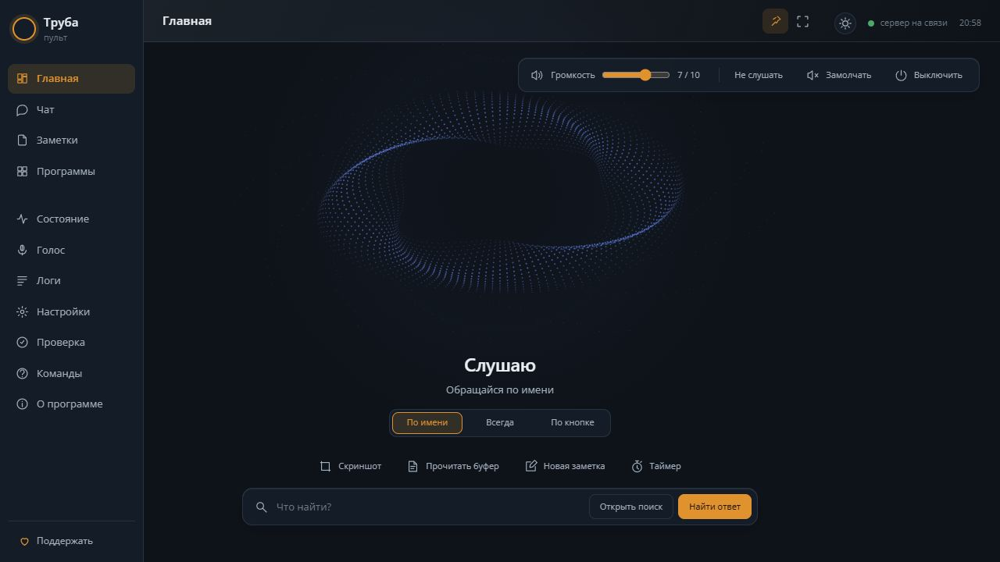
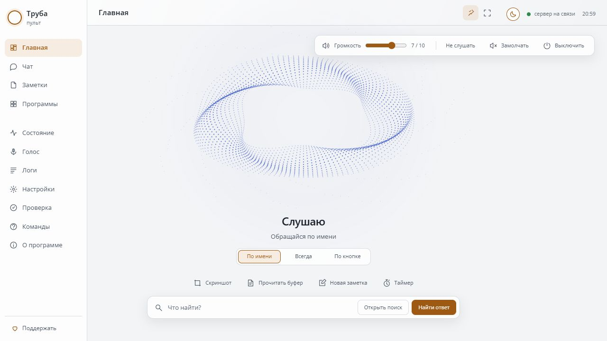
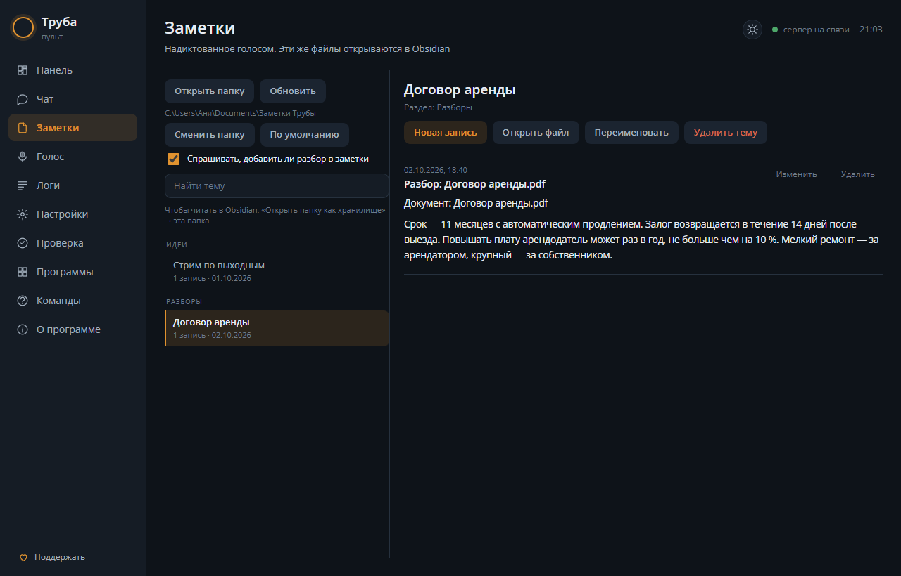

# Труба 1.0

**Голосовой ассистент для Windows: отвечает, выполняет команды компьютера
и превращает старый телефон в удобный пульт.**

[Скачать Трубу](https://github.com/levkeyvill/truba-assistant/releases/latest)
· [Как установить](#установка) · [Что нового в 1.0.2](#102--повторное-включение-голоса)
· [Поддержать проект](https://dalink.to/levkeyvill)

## Новая главная на компьютере

Громкость, режим слуха, быстрые действия и поиск собраны на одном экране.
«Открыть поиск» запускает браузер без модели, «Найти ответ» поручает поиск
и чтение источников ассистенту. Волны из точек плавно реагируют на голос
во время разговора.

**Тёмная тема**

**Светлая тема**

При бездействии управление скрывается, при наведении возвращается.
Булавка закрепляет кнопки на экране. Развёрнутое окно можно оставить
на втором мониторе: в спокойном режиме верхняя рамка тоже скрывается.
Телефон подключать необязательно — можно пользоваться пультом на ПК
и выводить голос в колонки.

## Старый телефон как пульт

Ненужный телефон на подставке у монитора становится сенсорной панелью, как
Stream Deck: кнопки твоих программ и сайтов, свои сочетания клавиш (сцена в
OBS, «заглушить себя» в Discord), нагрузка компьютера, часы и погода. Сетка,
значки и нижние кнопки настраиваются в пульте на живом макете телефона.

А ещё телефон — лицо и динамик голосового ассистента: говоришь — она отвечает
голосом и делает то, что попросишь. На телефон ничего не ставится: это
страница в браузере, подключение — по QR-коду в той же сети Wi-Fi. На iPhone
проверено автором: по инструкции ниже Труба открывается ярлыком с экрана
«Домой», звук идёт, экран сам не гаснет.

Телефона нет — не беда: Труба работает и без него, через колонки и окно
пульта на компьютере.

**Что умеет ассистент:** отвечать на вопросы и искать свежее в интернете (что
нашла — карточкой на телефоне, одно касание открывает поиск или страницу на
компьютере), запускать и закрывать программы из твоего списка, открывать
YouTube, делать снимок экрана и смотреть на него, сохранять игровой момент
NVIDIA, записывать заметки голосом (в папку, которую читает Obsidian) — а в
пульте их можно поправить, дописать руками и переименовать.

**Дела на компьютере голосом:**
- переключить раскладку — «переключи на английский»;
- музыка и звук — «пауза», «следующий трек», «звук компа на тридцать»,
  «выключи звук»;
- папки и диски — «открой загрузки», «открой диск D», «открой на диске D
  папку Torrent» (любая папка по названию), свои папки кнопкой;
- таймеры и напоминания — «напомни через двадцать минут вытащить пиццу»,
  «поставь таймер на пять минут»; список — в разделе «Состояние» пульта;
- файлы и документы — «найди и открой файл договор», «перескажи открытый
  документ» (Obsidian, Word, Блокнот), «прочитай вслух последний скачанный»,
  «закрой документ договор»: **вслух она читает сама, без интернета**, текст
  документа никуда не уходит. Читаются PDF, DOCX, RTF и обычные текстовые
  файлы. Название можно сказать как получится — она
  найдёт и «торрент», и «Torent», если папка называется Torrent.
- буфер обмена — «прочитай, что я скопировал», «переведи скопированное»
  (по умолчанию на русский), «перескажи скопированное», «найди ошибки в
  том, что я скопировал», а «исправь и положи обратно» кладёт готовый текст
  в буфер. При чтении вслух текст остаётся на компьютере; для перевода и
  разбора он отправляется выбранной модели;
- после разбора документа или скопированного текста она спросит «Добавить
  разбор в заметки?» — на «да» он ляжет в раздел «Разборы» со ссылкой на
  файл;
- питание компьютера — «выключи компьютер», «перезагрузи компьютер» или
  «отправь компьютер в сон». Труба переспросит и выполнит команду только
  после точного голосового подтверждения. Выключение и перезагрузку можно
  отменить голосом в течение минуты.

**Быстрые команды без облачной модели:** «загугли рецепт блинов»,
«найди в инете ремонт велосипеда», «поищи новости» или
«открой поиск в браузере C++» сразу открывают выдачу Google; «таймер на пять
минут» ставит обычный таймер; «прочитай скопированное» читает буфер вслух
на компьютере. Запуск программ, папки, музыка, громкость и снимки экрана
тоже выполняются локально по коротким командам. Для поиска с чтением
источников и ответом скажи «найди и расскажи …», «поищи и сравни …»,
«проверь в интернете …» или нажми
«Найти» на телефоне. Перевод, пересказ и сложные просьбы понимает модель.

Все фразы с примерами — в пульте на странице «Команды».
В разделе «О программе» кнопка «Проверить обновления» показывает список
изменений последнего выпуска, даже если он уже установлен.
При запуске пульт сам сообщает, когда появилась новая версия.
Качественные голоса Higgs и ESpeech ставятся кнопкой прямо в пульте, а все
настройки, программы, память и образцы голоса переносятся в новую установку
одним файлом.

**Как себя ведёт:** отзывается на имя «Труба»; после ответа несколько секунд
слушает без имени — можно продолжать разговор. «Хватит» или касание круга на
телефоне — замолчать; можно и просто заговорить поверх неё — замолкает сразу.
Шумоподавление убирает из микрофона звук колонок — Discord, YouTube, игры, —
поэтому голоса друзей и роликов она не принимает за твои и отвечает без
имени даже во время звонка. Сама не заговаривает, пока не включишь это в
настройках.

**Главная на компьютере:** компактные кнопки громкости, слуха и выключения,
анимация точек и волн по состоянию разговора, быстрые действия и поиск.
«Открыть поиск» открывает браузер без модели; «Найти ответ» начинает разбор
в чате. Управление скрывается при бездействии и возвращается при движении
мыши или нажатии клавиши; значок булавки оставляет его видимым. Полный экран
удобен для второго монитора. Нагрузка, расход и подробные статусы — в
отдельном разделе «Состояние».

**Кнопки телефона настраиваются в разделе «Программы».**

| Заметки: разбор документа по одному «да» | Мастер первого запуска и перенос настроек |
|---|---|
|  |  |

| Светлая тема |
|---|
|  |

## 1.0.2 — повторное включение голоса

Обновиться можно из раздела «О программе»; настройки, ключи, программы,
память и свои голоса сохраняются.

- После «Выключить» голос снова включается как надо. Раньше Труба говорила
  «Слушаю» и через пару секунд выключалась сама.
- Отчёт «Сообщить о проблеме» стал понятнее: в нём виден ход разговора — когда
  она услышала фразу и сколько слов ответила, почему пропустила, сколько ждала
  ответа. Самих слов, твоих и её, в отчёте по-прежнему нет.

## 1.0.1 — исправления после первых отзывов

Обновиться можно из раздела «О программе»; настройки, ключи, программы,
память и свои голоса сохраняются.

- Пульт больше не закрывается сам, когда выключаешь голос. Это случалось при
  включённом шумоподавлении колонок, если в колонках было тихо.
- Труба больше не молчит в ответ на сложные вопросы с DeepSeek. Модель тратила
  весь запас длины ответа на размышления, и на слова ничего не оставалось.
  Теперь размышления по умолчанию выключены, а включить их можно галочкой
  «Размышления перед ответом» в «Настройках». Если модель всё же не успеет
  ответить, Труба переспросит её, а не промолчит.
- Запас длины ответа по умолчанию теперь 500 вместо 220. Если у тебя стояло
  прежнее значение, оно поднимется само; своё значение останется.
- Режим слуха запоминается: если снова включить слух после «По кнопке»,
  вернётся тот режим, что был, а не всегда «По имени».
- В «Логах» новые кнопки. «Сохранить журнал» кладёт копию в «Загрузки»,
  «Открыть папку с журналом» показывает, где он лежит. «Сообщить о проблеме»
  собирает отчёт для автора: твоих разговоров в нём нет, зато есть запись о
  том, почему пульт закрылся сам, если такое случится.
- У образца голоса кнопка «Прослушать» на время звучания становится
  «Остановить».
- Пока ставятся качественные голоса или обновление, посередине окна видно
  предупреждение: Труба перезапускается, ничего нажимать не нужно.

## 1.0 — новый пульт и быстрые команды

Труба получила новый интерфейс для компьютера и отдельный путь для команд,
которым не нужна облачная модель. Обновиться с 0.9 можно из раздела
«О программе»; настройки, ключи, программы, память и свои голоса сохраняются.

- Главная на компьютере: компактное управление громкостью, слухом и
  выключением, быстрые действия и поиск. Спокойные волны из точек реагируют
  на голос во время разговора. Кнопки скрываются, когда окно не используется;
  в развёрнутом окне скрывается и верхняя рамка. В обычном размере элементы
  больше не перекрывают друг друга, рамка не дёргается при движении мыши.
- Светлая и тёмная тема, понятные группы на странице «Команды»: примеры
  фраз выделены, рядом показано, где нужна модель. Панель телефона сохраняет
  прежний вид.
- «Загугли», «найди в инете» и «поищи» открывают поиск в браузере без модели.
  «Найди и расскажи», «поищи и сравни» и «проверь в интернете» запускают
  поиск с чтением источников. На главной для этих действий отдельные кнопки.
- Короткие команды компьютера, таймеры и чтение скопированного выполняются
  локально. Перевод, пересказ, анализ и сложные просьбы обрабатывает модель.
- Исправлена очередь ответов при перебивании: отменённый ответ больше не
  возвращается после новой реплики. Продолжать разговор после её ответа
  стало удобнее; постоянное сообщение «Слышу тебя» убрано.
- Поддерживается чтение RTF. Длинные ответы и документы делятся на части
  для озвучивания, чтобы голос не обрывал разбор из-за длины одной фразы.
- Крестик спрашивает, закрыть ли Трубу; сворачивание убирает её в трей.

## Труба в разработке

Это ранняя версия, она активно дорабатывается, и что-то может работать не
так, как задумано. **Нашёл ошибку или что-то непонятно — напиши в Telegram:
[t.me/levkeyvill](https://t.me/levkeyvill).** Так автор узнает, что
исправлять первым. Помогает, если написать, что делал и что случилось, и
приложить отчёт: в пульте открой «Логи» и нажми «Сообщить о проблеме».
Отчёт ляжет в «Загрузки». Твоих разговоров в нём нет, только записи о сбоях,
в том числе о том, почему пульт закрылся сам. Если пульт не запускается
вовсе, пришли файлы `data\errors.log`, `data\crash.log` и `data\install.log`
из папки Трубы.

Ответы проверялись на двух моделях: GPT-6 Luna (OpenAI) и DeepSeek.
Остальные сервисы и локальные модели подключаются, но с Трубой пока не
проверялись — если пробуешь, расскажи, как работает.

## Что нужно

- Windows 10 или 11, 64 бита.
- Около 4 ГБ свободного места на диске.
- Микрофон и интернет.
- Ключ облачной модели: DeepSeek (около 100 ₽ в месяц при обычных
  разговорах), OpenRouter, MiniMax или OpenAI. Своя локальная модель тоже
  подключается — Ollama, LM Studio или llama.cpp, тогда ключ не нужен
  вовсе, но с Трубой она пока не проверялась.
- Старый телефон — по желанию.

Видеокарта не нужна: на процессоре всё работает. С видеокартой NVIDIA можно
поставить качественные голоса.

## Установка

1. Скачай ZIP со страницы выпусков:
   [github.com/levkeyvill/truba-assistant/releases](https://github.com/levkeyvill/truba-assistant/releases)
   — у последнего выпуска в списке Assets файл **Source code (zip)**.
2. **Распакуй в папку, в пути к которой нет русских букв.** Например
   `C:\Truba`. В `C:\Users\Иван\Рабочий стол\Труба` пульт не запустится:
   Windows читает `.venv\pyvenv.cfg` как ANSI-текст, и русские буквы в пути
   он прочитает криво. Установщик такой путь сам не пропустит и скажет, куда
   перенести. Внутри архива папка `truba-assistant-…` — всё нужное в ней.
3. Дважды щёлкни по файлу **«Установить Трубу»**. Windows может
   предупредить, что файл скачан из интернета («Система Windows защитила
   ваш компьютер») — нажми «Подробнее» → «Выполнить в любом случае».
   Появится чёрное окно: установщик скажет, что и куда поставит, и
   спросит — **нажми Д**, чтобы начать (любая другая клавиша — отмена).
   Дальше по шагам видно, что происходит: примерно 15–25 минут, больше
   всего времени уходит на библиотеки и модели. Окно можно свернуть,
   установка сама не остановится.
4. Когда появится «Готово! Труба установлена. Запускаю…», откроется пульт и
   **мастер первой настройки**: сервис и ключ (с кнопкой «Где взять ключ»),
   характер, микрофон и звук, город для погоды и телефон по QR-коду. Любой
   шаг можно пропустить и вернуться к нему потом — «О программе → Пройти
   первую настройку заново».

Ярлык «Труба» появится на рабочем столе и в меню «Пуск». Крестик спрашивает,
закрыть ли Трубу. При сворачивании пульт прячется в трей и продолжает
работать; открыть его снова можно через значок рядом с часами.

Если установка оборвалась — запусти «Установить Трубу» ещё раз. Она продолжит
с того места, где остановилась, и уже скачанное не качает заново. Подробности
ошибки — в файле `data\install.log`. Если окружение почему-то сломалось, есть
ключ `-Repair`: `Установить Трубу.bat -Repair` пересоздаёт `.venv` с нуля
(остальное остаётся на месте).
В 0.9.8 исправлена ложная ошибка последней проверки окружения, из-за которой
установка 0.9.7 могла остановиться уже после загрузки всех библиотек и моделей.

## Качественные голоса

По умолчанию Труба говорит голосом Silero — он звучит на процессоре и есть в
базовой установке. Голоса Higgs и ESpeech звучат естественнее, но им нужна
видеокарта NVIDIA и ещё около 10 ГБ на диске.

«Голос → Озвучивание» → «Твой компьютер» покажет, что потянет твоё железо, и
там же выбор моделей: Higgs (скачать 9,3 ГБ) и ESpeech (2,7 ГБ). Отметь
нужную и нажми **«Установить выбранное»** — пульт сам поставит библиотеки
(около 4,5 ГБ, 10–20 минут) и скачает модель, с полосой и кнопкой
«Отменить». Если видеокарты NVIDIA нет, пульт скажет об этом и ничего
лишнего не поставит. Запасной путь — файл «Установить качественные голоса»
в папке Трубы: он ставит те же библиотеки в отдельном окне.

**Про Higgs.** Модель Higgs TTS 3 от Boson AI официально работает только на
Linux, через сервер SGLang и с расчётом на видеокарту с 40 ГБ памяти. В Трубе
она переписана на обычный PyTorch под Windows по открытому коду
[SGLang-Omni](https://github.com/sgl-project/sglang-omni) и ужата: веса слоёв
хранятся в FP8, поэтому на RTX 5070 Ti голос занимает около 4.3 ГБ
видеопамяти вместо 9.3 и уживается рядом с игрой. Говорит потоком: первый
звук примерно через полсекунды после готового предложения. Сжатие проверено
замерами: речь распознаётся обратно слово в слово так же, как без него, и
похожа на образец не меньше. FP8 есть только у видеокарт RTX 40-й и 50-й
серии, поэтому Higgs нужна одна из них и от 8 ГБ видеопамяти. На других
картах NVIDIA с 4 ГБ и больше работает ESpeech.

Свой голос из записи — «Голос → Озвучивание → Новый голос из записи».
**Только свой голос или голос человека, который разрешил его копировать** —
это условие лицензии Higgs и просто честно по отношению к людям.

## Телефон

«Настройки → Телефон» (или последний шаг мастера): наведи камеру телефона на
QR-код или открой на телефоне ссылку из пульта целиком — телефон должен быть в
той же сети Wi-Fi, что и компьютер. В ссылке ключ привязки: телефон
запоминает его один раз, а чужие устройства в той же сети к Трубе не
подключатся — ни экран снять, ни заметки прочитать. Коснись экрана телефона —
так браузер разрешит звук. Windows может
спросить разрешение на сеть для Трубы при первом запуске — разреши, это нужно
для телефона. Правило в брандмауэре ставит файл `razreshit_telefon.bat`
(запускается от имени администратора, разрешает только порт 8765 в домашних
сетях).

Касание погоды рядом с часами — прогноз на сегодня и завтра:

### Как открыть Трубу на весь экран

Открывай Трубу с иконки на главном экране телефона. Если браузер поставил
веб-приложение, его панели могут скрыться. Если он создал обычный ярлык,
панели останутся. Труба открывается по домашнему HTTP-адресу компьютера;
для установки веб-приложений браузеры обычно требуют HTTPS, поэтому полный
экран на таком адресе гарантировать нельзя. Те же шаги есть в «Настройки →
Телефон» и в последнем шаге мастера.

1. **Firefox на Android.** Открой адрес Трубы в Firefox → меню (три точки) →
   «Установить» («Install») или «Добавить на главный экран».
   Открывай с появившейся иконки. Firefox может создать обычный ярлык,
   который откроется с панелью браузера; полный экран он не гарантирует.
2. **iPhone (Safari или Firefox).** На iPhone полный экран у страниц не
   работает: кнопка «во весь экран» там ничего не делает, так устроен сам
   телефон. Панели браузера прячет только ярлык «На экран „Домой“» с
   включённой галочкой «Открывать как веб-приложение». Открой адрес Трубы
   в Safari или в Firefox, нажми «Поделиться», выбери «На экран „Домой“»,
   включи «Открывать как веб-приложение» и нажми «Добавить». Затем открывай
   с появившейся иконки. Ярлык добавляй со страницы, открытой по QR-коду из
   пульта: только тогда он привязан к компьютеру. Ярлык из обычного адреса
   без ключа Трубу не покажет, и на экране будет написано, что ярлык не
   привязан.
3. **Chrome на Android.** Меню (три точки) → «Установить приложение», если
   такой пункт есть, и открывай с иконки. «Добавить на главный экран» может
   создать лишь ярлык с панелью браузера; полный экран на домашнем HTTP-адресе
   не обещан.

### Чтобы экран телефона не гас

Держать экран включённым браузер разрешает только «защищённым» адресам
(https), а Труба в домашней сети открывается по обычному http — поэтому
телефон засыпает по своему таймеру. Настоящий https для этого не нужен,
хватит любого из двух способов (они же — в «Настройки → Телефон», там сразу
подставлен адрес твоего компьютера):

1. **Телефон на зарядке — «Не выключать экран».** Настройки телефона →
   «О телефоне» → 7 раз коснись «Номер сборки» (на Xiaomi — «Версия MIUI»
   или «Версия ОС»). Появится раздел «Для разработчиков» (на Xiaomi — в
   «Расширенных настройках»): включи в нём «Не выключать экран». Пока
   телефон заряжается, экран не гаснет.
2. **Без зарядки — флажок в Chrome.** В Chrome на телефоне набери в
   адресной строке `chrome://flags/#unsafely-treat-insecure-origin-as-secure`
   (такие адреса открываются только руками). В поле впиши адрес Трубы из
   пульта, например `http://192.168.1.5:8765`, справа выбери **Enabled** и
   нажми **Relaunch**. Экран перестанет гаснуть, а на телефоне появится его
   заряд.

## Что уходит в интернет

- Твои фразы и её ответы — в выбранный сервис ответов (через него же она
  выписывает память и приводит в порядок заметки). С локальной моделью —
  никуда.
- Снимок экрана — только когда просишь посмотреть или если включено «Иногда
  смотреть на экран».
- Скопированный текст — только когда просишь перевести или разобрать его.
  Текст документа — когда просишь пересказать его или спрашиваешь по нему.
  Чтение вслух никуда не уходит.
- Поисковые запросы — в поисковики; погода — в Open-Meteo, если выбран город.
- Распознавание речи и голос работают на этом компьютере, память, заметки и
  настройки хранятся в папке Трубы.

## Обновление

«О программе» → «Проверить обновления», дальше «Обновить». Пульт сам скачает
новую версию, поставит библиотеки, если они новые, перезапустится и вернётся
на место. Перед обновлением делается копия, откат — из той же копии.

Ставишь Трубу заново или на другой компьютер — «Настройки → Система →
Перенос настроек» сохранит настройки, программы, характер, память и образцы
голоса в один файл. В новой Трубе тот же раздел (или первый шаг мастера)
переносит их обратно.

## Удаление

Закрой пульт, удали папку Трубы и два ярлыка: с рабочего стола и из меню
«Пуск». Всё. Всё остальное — Python, модели, настройки, логи — лежит внутри
этой папки и удаляется вместе с ней.

## Лицензии

Код Трубы — [PolyForm Noncommercial 1.0.0](LICENSE). Коротко:

- **можно** — пользоваться, изучать, переделывать под себя и бесплатно
  делиться, в том числе переделанной версией (с указанием автора и этой
  лицензии);
- **нельзя** — продавать Трубу или её переделку, брать деньги за установку,
  встраивать в платный продукт или сервис.

Для коммерческого использования — напиши автору.

Модели скачиваются с Hugging Face и GitHub и идут под своими лицензиями —
список в [THIRD_PARTY.md](THIRD_PARTY.md). Голос по умолчанию (Silero) и
голос Higgs тоже только для некоммерческого использования.

## Что дальше

План развития — в [ROADMAP.md](ROADMAP.md): микрофон телефона, склейка
тем в заметках, свои темы для телефона и каталог тем.

## Поддержать автора

Автор — Лев Кейвилл.

- Telegram: https://t.me/levkeyvill
- YouTube: https://www.youtube.com/@levkeyvill
- Донат: https://dalink.to/levkeyvill

Труба бесплатная, код открыт, донаты добровольные и ничего не открывают:
[исходный код на GitHub](https://github.com/levkeyvill/truba-assistant).
